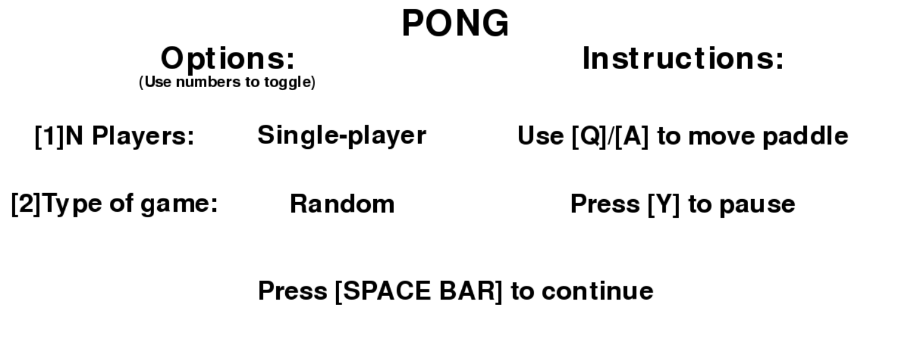
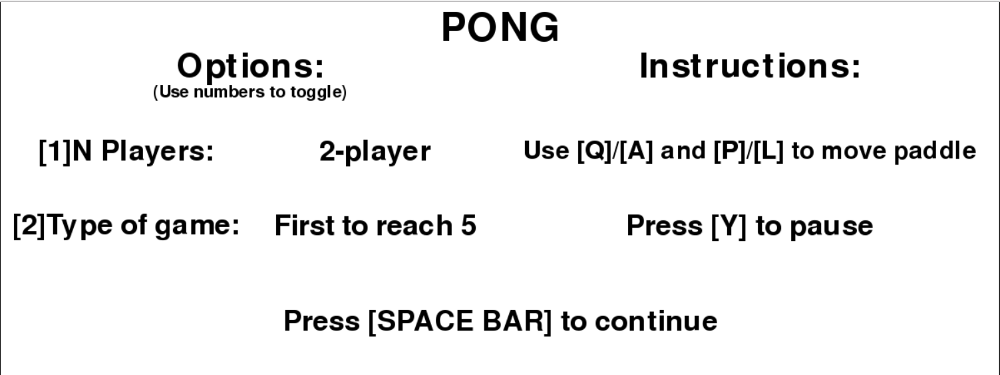

# Pong
## pure Python 3.4 code (and pygame)

### Notes:
* To alter colors, frames-per-second, etc, edit constants.py. Most of those vars are stored there

## Screenshots:

### Intro Screen:

### During the Game:

#### Normal situation:

#### Pause:

#### Match Point:

### Game Over Screen:

